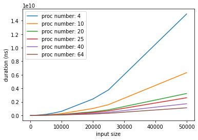
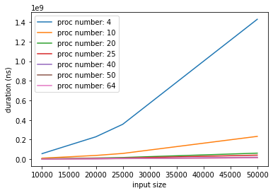

# Report — CSC4005 AS1 (Odd Even Sort)

## Design
* Algorithms: 
  > Sequential
  
  > Parallel (Odd Even Sort)

  > Parallel (Merge Odd Even Sort)

## Result

 

Figure 1: Odd Even Sort with input size (0 ~ 50000)

Figure 2: Merge Odd Even Sort with input size (0 ~ 50000)

## Conclusion 